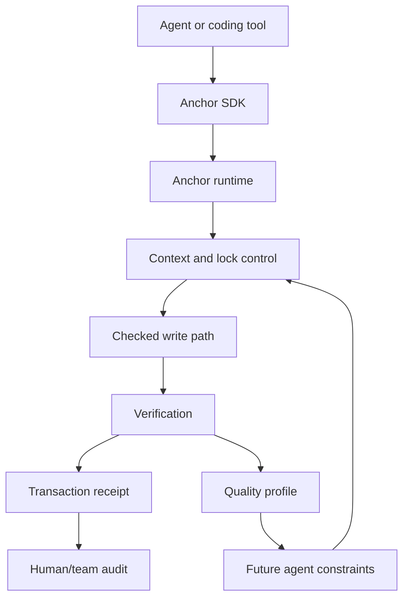

# Anchor Transaction, Quality, And SDK Strategy

This document defines three product layers for Anchor:

1. Transaction / Provenance Kernel
2. Quality Kernel
3. Agent Execution SDK

The goal is not to claim that every individual piece is new. Logs, CI, traces,
quality gates, SDKs, and sandboxes already exist. The goal is to identify what
Anchor can own as a full system: controlled agent execution over real codebases.

Anchor becomes valuable only if it gives agents and teams something they do not
want to rebuild themselves: a reliable execution layer with context control,
write control, coordination, proof, quality feedback, and integration points.

## Short Version

Anchor should be framed as:

> The execution layer for coding agents: controlled context, scoped writes,
> transaction provenance, quality feedback, and SDK access across tools.

The three layers work together:

```text
Agent / coding tool
    |
    v
Agent Execution SDK
    |
    v
Anchor runtime
    |
    |-- context serving
    |-- lock ownership
    |-- checked writes
    |-- verification
    |-- transaction provenance
    |-- quality scoring
    |
    v
Repository / workspace
```

Zev is a separate research layer. Zev can later change the representation agents
read and write, but Anchor should already be useful before Zev.

## 1. Transaction / Provenance Kernel

### What It Is

The Transaction / Provenance Kernel turns agent work into a verifiable execution
record.

Instead of an agent session being only a chat transcript and a final diff,
Anchor records the actual repo-level execution path:

- what context was requested
- what context was returned
- what symbols/files were targeted
- what locks were acquired
- what files changed
- what hashes existed before and after
- what commands/tests/checks ran
- what failed
- what passed
- what got accepted, retried, reverted, or rolled back

This is similar in spirit to a database transaction log or an audit log, but for
agent work on code.

### How It Works

Anchor should model an agent session as a sequence of append-only events.

Example event stream:

```text
session.start
task.requested
context.read
lock.acquire
edit.proposed
edit.applied
index.updated
verify.started
verify.finished
quality.scored
review.accepted
session.closed
```

Every event should be tied to stable identifiers:

- session id
- agent id
- owner id
- target symbol/file
- before hash
- after hash
- command id
- test/check result
- timestamp
- workspace/repo state

The important point is causality.

Normal Git can show:

```text
this file changed
```

Anchor should show:

```text
this agent read these symbols, locked this target, applied this edit, ran these
checks, got these results, and produced this final repo state
```

### How It Helps

It helps humans trust agent work because agent execution stops being opaque.

It helps teams answer practical questions:

- Why did this agent edit this file?
- Did it read the right context first?
- Did it overwrite another agent?
- Did it run the required checks?
- Which exact operation introduced the failure?
- Can we replay the session?
- Can we roll back only the agent's work?
- Can another agent resume from the same state?

For multi-agent work, this is essential. If two agents work in the same repo,
the team needs to know who claimed what, who changed what, and which actions
conflicted.

### Effects

Grounded expected effects:

- more trust in agent work
- easier review of agent sessions
- easier debugging of failed agent work
- safer parallel agent sessions
- better rollback and recovery
- better compliance/audit story for teams
- less reliance on fragile chat transcripts

This does not magically prove the code is correct. It proves what happened and
gives enough evidence to inspect, replay, reject, or trust the result.

### Does This Already Exist?

Pieces exist.

- Git records committed file history.
- CI systems record build/test logs.
- LangSmith and LangFuse record LLM traces and tool calls.
- Claude Code has hooks and permissions.
- GitHub Copilot coding agent can work in isolated environments and create pull
  requests.
- OpenHands describes an agent control-plane direction with sandboxed execution.
- SLSA/in-toto/Sigstore-style systems record supply-chain provenance.

What is less common is one repo-aware execution record that joins all of this:

```text
agent context -> lock -> write -> verification -> file hashes -> quality result
```

Most tools observe either the model side or the repository side. Anchor should
own the bridge between them.

### R&D Direction: A Better Way

The proprietary wedge should be the **Anchor Execution Receipt**.

An execution receipt is a compact proof packet for one agent task:

```text
receipt:
  task: "fix auth refresh token bug"
  agent: "codex-session-12"
  context:
    - auth.refresh_token hash=...
    - auth.revoke_token hash=...
  locks:
    - symbol auth.refresh_token owner=...
  writes:
    - auth/token.py before=... after=...
  checks:
    - pytest tests/auth passed
    - ruff passed
  quality:
    - scope: narrow
    - verification: sufficient
    - risk: medium
  outcome: accepted
```

This receipt is what humans, CI, cloud teams, future agents, and auditors can
consume. It should be easier to trust than a raw diff and easier to understand
than a full chat transcript.

The better way is not "more logs." The better way is a structured transaction
record designed specifically for coding agents.

## 2. Quality Kernel

### What It Is

The Quality Kernel measures and improves the quality of generated code by tying
code outcomes back to the agent execution path.

It is not just:

```text
run tests
```

Existing tools already run tests, typechecks, lint, and security scans.

Anchor's Quality Kernel should answer a deeper question:

> Did this agent produce a good, scoped, verified, maintainable change, and what
> should future agents learn from this session?

### How It Works

The Quality Kernel should combine several signals.

#### 1. Correctness Signals

These mostly come from existing tools:

- build pass/fail
- tests pass/fail
- typecheck pass/fail
- linter pass/fail
- import resolution
- impacted tests
- integration checks

Anchor should not pretend these are unique. Anchor uses them as sensors.

#### 2. Scope Signals

Anchor can measure whether the agent stayed inside the expected work area:

- number of touched files
- number of touched symbols
- whether touched files match the task
- whether unrelated areas changed
- whether a symbol lock was respected
- whether the diff grew too wide

This matters because agent-authored changes often fail when they become too
large, too broad, or too indirect.

#### 3. Context Signals

Anchor can measure what the agent read before writing:

- did the agent read the edited symbol?
- did it read direct callers/callees?
- did it read related tests?
- did it read ownership/config files when needed?
- did it edit without enough context?

This is different from normal CI. CI sees the final code. Anchor sees whether
the agent had enough information before it changed the code.

#### 4. Maintainability Signals

Anchor can use existing static analysis plus repo-specific rules:

- complexity increased or decreased
- duplication increased or decreased
- function length increased heavily
- naming/style conventions were followed
- dead code was introduced
- generated code became harder to review

The first version should keep this simple. Do not over-promise. Start with
measurable signals, then improve over time.

#### 5. Security/Safety Signals

Security is part of quality, not the whole product.

Signals can include:

- secret scanning
- dependency/security scanning
- unsafe auth changes
- obvious injection patterns
- missing validation in sensitive paths
- unsafe file/network operations

Anchor should integrate existing scanners before trying to invent a full
security engine.

#### 6. Review And Outcome Signals

The strongest signal is what happened after the agent wrote the code:

- human accepted the change
- human rejected the change
- patch was reverted
- tests failed later
- review requested changes
- another agent had to repair it
- same failure repeated in the same area

This is where Anchor can build durable quality memory.

### How It Helps

The Quality Kernel helps agents by turning failures into future constraints.

Example:

```text
Agent edits auth token code.
Tests fail because it did not read token expiry policy.
Human fixes the issue.
Anchor records that missing token-expiry context caused the failure.
Next time an agent edits auth token code, Anchor requires that context first.
```

The key idea:

```text
failure -> structured cause -> regression memory -> better next session
```

Anchor should not only reject bad output. It should make future agent work less
likely to repeat the same mistake.

### Effects

Grounded expected effects:

- cleaner generated changes
- fewer wide/unrelated diffs
- better test/check selection
- better reviewability
- fewer repeated agent mistakes
- faster diagnosis of failed sessions
- more confidence in accepted agent changes
- better long-term maintainability if the quality loop is actually enforced

This does not guarantee perfect code. It cannot infer every business rule from
nothing. If the repo has no tests, no docs, no review signal, and ambiguous
business logic, Anchor cannot magically know the correct answer.

The real claim is narrower and stronger:

> Anchor can make generated code quality measurable and can use those
> measurements to control future agent behavior.

### Does This Already Exist?

Pieces exist.

- SonarQube quality gates and AI Code Assurance check generated code quality.
- Veracode, Snyk, Semgrep, CodeQL, and similar tools scan for security issues.
- CI systems run tests and typechecks.
- LangSmith, LangFuse, Braintrust, and OpenAI/Anthropic eval tooling measure
  model and agent traces.
- Code review tools measure review outcomes.

The gap is that these tools usually do not control the agent's full repo
execution path.

They may know:

```text
this PR failed tests
```

Anchor should know:

```text
this PR failed tests after the agent skipped these related symbols, edited this
locked area, touched these unrelated files, and did not run the impacted tests
```

That is the difference.

### R&D Direction: A Better Way

The proprietary wedge should be the **Agent Quality Profile**.

For every session, Anchor should compute a quality profile:

```text
quality_profile:
  context_sufficiency: high | medium | low
  write_scope: narrow | broad | unsafe
  verification: complete | partial | missing
  maintainability_delta: improved | neutral | degraded
  security_risk: low | medium | high
  review_outcome: accepted | rejected | unknown
  rollback_risk: low | medium | high
```

Then Anchor can apply policy:

```text
if context_sufficiency is low:
  require more context before write

if write_scope is broad:
  require human approval

if verification is missing:
  block accept

if same failure repeated:
  create regression memory
```

This becomes stronger over time because it is repo-specific. The proprietary
value is not a generic quality score. The value is a quality loop tied to real
agent behavior in a real repository.

## 3. Agent Execution SDK

### What It Is

An SDK is a Software Development Kit: a language-native library that lets another
program use a system easily.

For Anchor, the Agent Execution SDK is how coding tools and custom agents call
Anchor directly.

Without SDK:

```bash
anchor context auth.login
anchor lock auth.login
anchor edit auth.login --action replace ...
anchor verify
```

With SDK:

```python
ctx = anchor.context("auth.login")

with anchor.lock("auth.login"):
    anchor.edit("auth.login", patch)
    anchor.verify()
```

The SDK is not Zev.

- SDK = how a tool talks to Anchor
- Zev = the compact code representation agents may read/write later
- Anchor = the runtime/harness that controls context, writes, locks, verification

### How It Works

The safest order is:

1. Make Anchor CLI JSON stable.
2. Define an Anchor execution protocol/spec.
3. Implement thin SDKs over that protocol.
4. Add cloud/daemon transport later.
5. Keep all SDKs contract-tested against the same runtime.

The SDK should expose agent-native operations:

```text
context(symbol_or_file)
related(symbol)
lock(target)
edit(target, patch)
write(path, content)
verify(target)
rollback(session)
status(session)
receipt(session)
quality(session)
```

Later, the payloads can be Zev:

```text
context(...) -> Zev
edit(..., zev_patch) -> source patch
```

But the SDK still matters because the agent/tool needs a standard way to ask
Anchor for work actions.

### How It Helps

The SDK helps agents and tools by replacing fragile shell glue with a stable
interface.

It helps:

- custom agents integrate Anchor directly
- IDEs call Anchor without parsing terminal output
- CI systems request receipts/quality status
- cloud sessions coordinate through the same protocol
- multiple languages use Anchor the same way
- future Zev workflows plug into the same actions

This is the Stainless lesson, applied carefully.

Stainless was valuable because it solved a boring infrastructure problem
extremely well: high-quality SDK generation from API specs. Anchor should not
copy Stainless directly, but it can learn the pattern:

> become the boring, reliable interface layer that everyone else would rather
> depend on than rebuild.

For Anchor, that interface layer is not API SDK generation. It is agent
execution over codebases.

### Effects

Grounded expected effects:

- easier integration with coding agents
- less brittle terminal parsing
- more adoption by external tools
- one stable interface for local and cloud Anchor
- language-native usage for teams
- cleaner path to enterprise integrations
- less duplicate integration code

This does not by itself make agents smarter. It makes Anchor easier to embed.
The quality and efficiency gains come from what the SDK exposes: scoped context,
locks, writes, verification, provenance, and quality feedback.

### Does This Already Exist?

SDKs already exist everywhere.

- OpenAI, Anthropic, Stripe, GitHub, and almost every API platform have SDKs.
- Stainless, OpenAPI Generator, Fern, and Speakeasy generate SDKs from API specs.
- Claude Code, GitHub Copilot coding agent, Cursor, OpenHands, and other tools
  expose their own agent workflows or integrations.

The thing to avoid:

```text
"Anchor has SDKs, therefore Anchor is unique."
```

That is weak. SDKs are not unique.

The stronger claim:

```text
Anchor defines an execution protocol for coding agents, and SDKs make that
protocol easy to embed across tools and languages.
```

The protocol is the important part. SDKs are distribution.

### R&D Direction: A Better Way

The proprietary wedge should be **AnchorSpec**.

AnchorSpec is the stable contract for agent execution:

```text
ContextRequest
ContextBundle
LockRequest
EditRequest
VerifyRequest
ExecutionReceipt
QualityProfile
RollbackRequest
SessionStatus
```

SDKs should be generated or kept thin from AnchorSpec.

This prevents SDK maintenance from becoming a burden. The core product stays in
Anchor runtime. SDKs are adapters.

The better way is:

```text
AnchorSpec -> generated/contract-tested SDKs -> agents/tools integrate Anchor
```

not:

```text
handwrite five SDKs and let them drift
```

## How The Three Layers Fit Together



The product loop:

```text
controlled execution -> transaction proof -> quality scoring -> future policy
```

That loop is more important than any single feature.

## Honest Competitive Position

Anchor is not alone in the broad domain of AI coding tools.

Existing adjacent areas:

- coding agents
- code search/indexing
- CI/CD
- static analysis
- AI eval/observability
- sandboxed agent runtimes
- SDK generation
- provenance/audit systems

The defensible Anchor position should be:

> Anchor is the repo-aware execution layer for coding agents. It joins context,
> locks, writes, verification, provenance, and quality feedback into one
> controlled workflow.

If another system already does that full loop better, Anchor must adapt. The
goal is not to pretend nothing exists. The goal is to build the part that is
painful enough and specific enough that teams would rather use Anchor than
recreate it.

## What Must Become Proprietary To Anchor

"Proprietary" here means uniquely associated with Anchor, even if the code is
open source. It means the product has a recognizable core that people use it
for.

The likely proprietary cores are:

1. **Execution Receipt**
   - the proof packet for what an agent did

2. **Agent Quality Profile**
   - the code-quality score tied to context, writes, checks, and outcomes

3. **AnchorSpec**
   - the execution protocol used by SDKs and tools

4. **Symbol/session locking model**
   - multiple agents working in one repo without blindly overwriting each other

5. **Regression memory from agent sessions**
   - failed agent work becomes future policy and tests

6. **Later Zev integration**
   - agents read/write a compact representation instead of raw source

The Stainless lesson is not "build SDKs." The Stainless lesson is:

> solve one boring infrastructure layer so well that everyone else trusts you
> with it.

For Anchor, that boring infrastructure layer should be:

> controlled, provable, quality-aware execution for coding agents.

## Practical Build Order

The practical order should be:

1. Finish reliable CLI execution.
2. Add structured JSON outputs.
3. Add append-only transaction events.
4. Generate execution receipts.
5. Add basic quality profiles from real checks and scope/context signals.
6. Define AnchorSpec.
7. Build one SDK first, likely TypeScript or Python.
8. Add contract tests.
9. Add more SDKs only after the protocol is stable.
10. Keep Zev as R&D until it has measured benefit.

This keeps the product grounded. Anchor becomes useful now, while Zev remains
the larger research upside.

## Source Notes

Useful adjacent references:

- Anthropic acquired Stainless:
  https://www.anthropic.com/news/anthropic-acquires-stainless
- Stainless SDK generation:
  https://www.stainless.com/
- GitHub Copilot coding agent:
  https://docs.github.com/en/copilot/concepts/coding-agent/coding-agent
- Claude Code hooks:
  https://docs.anthropic.com/en/docs/claude-code/hooks
- OpenHands agent control plane:
  https://www.openhands.dev/blog/openhands-enterprise-agent-control-plane
- LangSmith observability/evaluation:
  https://docs.langchain.com/langsmith/
- Langfuse observability/evaluation:
  https://langfuse.com/docs
- Sonar AI Code Assurance:
  https://docs.sonarsource.com/sonarqube-server/ai-capabilities/ai-code-assurance/
- Veracode GenAI code security:
  https://www.veracode.com/blog/spring-2026-genai-code-security/
