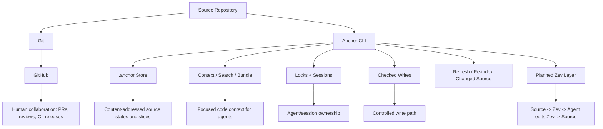
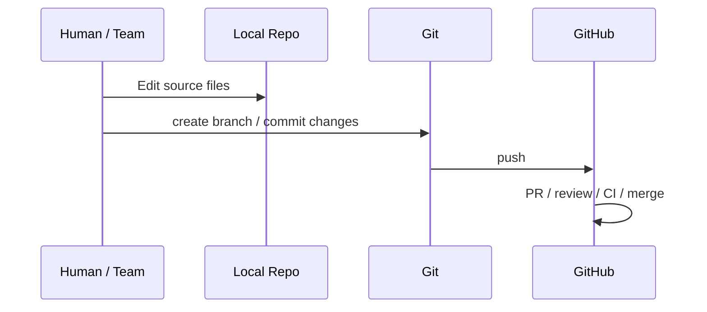
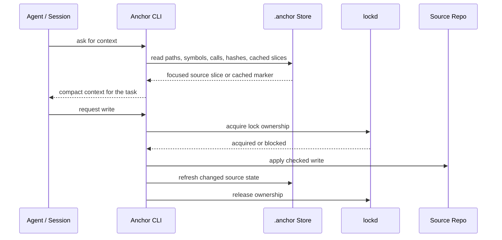
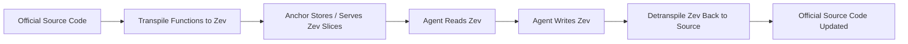

# Anchor vs GitHub

Anchor is not a replacement for Git or GitHub.

Git and GitHub are built around human collaboration on repository history:
branches, commits, pull requests, reviews, CI, releases, and hosted remotes.

Anchor is built around agent execution inside a working codebase. It gives
agents a controlled way to read code, write code, coordinate ownership, and keep
repo-local state fresh while work is happening.

Anchor uses Git-like thinking, but it does **not** mean Anchor has Git's exact
primitives. Anchor does not need to expose commits, history, diffs, or merges to
be Git-like. The Git-like part is the object-store mindset:

- content-addressed source states and slices
- repo-local `.anchor/` state
- stable object references
- cached context when content has not changed
- explicit ownership and write state
- CLI workflows over a repository

Short version:

> GitHub coordinates human collaboration around Git history. Anchor coordinates
> AI-agent execution while agents are reading, editing, locking, and updating a
> codebase.

---

## The Boundary

GitHub starts from repository collaboration: push code, open PRs, review diffs,
run checks, and merge when humans accept the change.

Anchor starts earlier. It manages the active agent work session:

- What code should the agent read?
- Which symbol or slice is relevant?
- Has this content already been sent unchanged?
- Is another agent/session already working on this area?
- Can this write be applied through the harness?
- After the write, what source needs to be refreshed?
- Later: should the agent read/write Zev instead of raw source?

That makes Anchor an execution harness for agents, not a hosting platform and
not a code-indexing product.

---

## System Shape

GitHub is the collaboration layer around Git history.

Anchor is the active execution layer beside the working repo. Agents use Anchor
while they are doing the work. Git/GitHub can still handle the final repository
workflow after changes exist in source.

---

## GitHub Workflow

GitHub sees code as repository history and reviewable changes.

It does not decide which code an agent should read, which symbol an agent owns,
or whether two agents are racing on the same working tree.

---

## Anchor Workflow

Anchor controls the agent's read/write loop while the work is active.

The first surface is CLI. The cloud/team version can later provide managed
shared sessions, lock state, and coordinated worktrees for teams that do not
want to run the infrastructure themselves.

---

## What Anchor Owns

Anchor owns the agent execution state:

- repo-local `.anchor/` store
- content-addressed source states and slices
- path, symbol, and call indexes as internal acceleration structures
- focused context/bundle results
- session identity
- lock ownership
- checked write path
- post-write refresh/re-indexing
- planned Zev transpile/detranspile state

The indexes are not the product. They are internal structures that help Anchor
answer execution questions quickly.

The product idea is the harness: agents read and write through Anchor instead of
blindly browsing and editing raw files.

---

## Where Zev Changes The Model

Today, the agent reads and writes source-code slices through Anchor.

With Zev, the unit of work changes:

This is the Rosetta layer.

The agent does not need to directly handle every source language's full syntax.
Anchor can present compact Zev, accept Zev edits, and convert those edits back
to the official repository language.

That is different from GitHub. GitHub stores and reviews source-code
collaboration. Anchor controls the representation and execution path agents use
before the final source change is ready for normal repository workflows.

---

## The Difference From GitHub

GitHub answers:

- Where is the hosted repo?
- What branch changed?
- What should humans review?
- Did CI pass?
- Should this PR merge?

Anchor answers:

- What should this agent read right now?
- What content can be reused from cache?
- Which agent/session owns this symbol or range?
- Is this write allowed now?
- How should the source state be refreshed after the write?
- Later, how does this source become Zev and back again?

---

## One-Line Difference

> GitHub is collaboration around Git history. Anchor is a CLI-first execution
> harness for AI agents actively reading, writing, coordinating, and eventually
> translating code through Zev.

